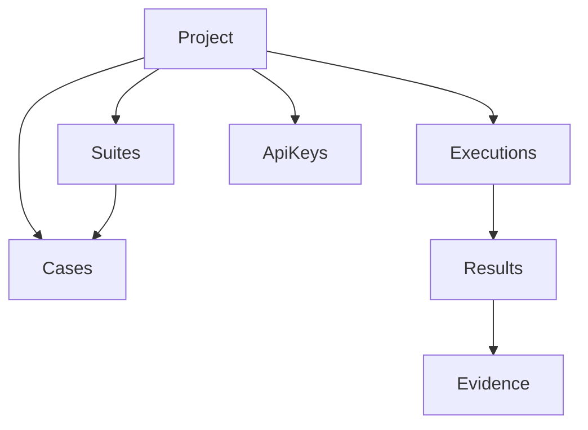

Use these terms consistently. They match the product `CONTEXT.md` language.

| Concept | One-liner |
| --- | --- |
| [Project](/concepts/project) | Tenancy boundary for cases, suites, keys, and members |
| [Case](/concepts/case) | A test case with steps, labels, and optional automation key |
| [Suite](/concepts/suite) | A named grouping of cases for execution |
| [Execution (Run)](/concepts/execution) | A single run of cases — manual or automated |
| [Evidence](/concepts/evidence) | Attachments and observed step screenshots for a result |
| [API key](/concepts/api-key) | Project-scoped credential for CI and SDKs |
| [Portable Catalog](/concepts/portable-catalog) | JSON import shape requiring automation keys |
| [Reporting env](/concepts/reporting-env) | `TESTLAB_*` variables written by CLI init |

