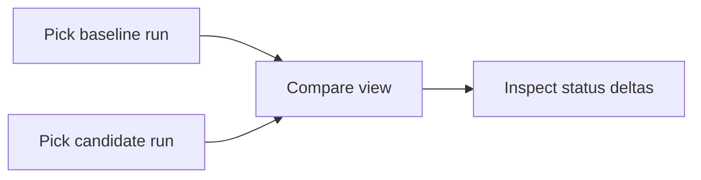

Open **`/executions/compare`** (or use compare entry points from Runs) to select
two executions and review differences in case outcomes.

Use compare after a nightly or release train to find new failures without reading
the full case list on each run.

## Related

- [Runs](/docs/web-app/runs)
