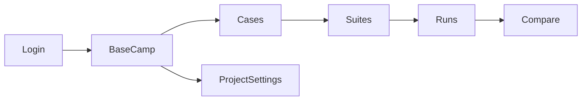

The web app is organized into **Rooms** in the sidebar:

| Room | Route | Purpose |
| --- | --- | --- |
| Base Camp | `/` | Home / entry |
| Cases | `/test-cases` | Case list, create, import/export |
| Suites | `/suites` | Suite cards and linking |
| Runs | `/executions` | Execution list and detail |
| Docs | `/docs` | In-app docs link (points at this site after cutover) |
| Project | `/projects/:id/settings/*` | General, members, API keys, automation |

Additional surfaces:

- [Compare](/docs/web-app/compare) — `/executions/compare`
- [CLI device login](/docs/web-app/cli-device-login) — `/cli/device`
- Automations — `/automations` and Project → Automation

