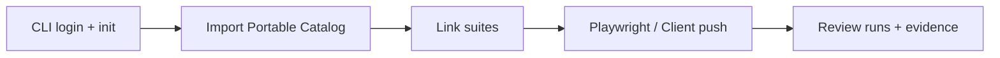

## Product documentation

TestLab is where cases live, executions are tracked, and evidence is reviewed.
The TestLab SDK reports automated results into that product.

<CardGroup cols={2}>
  <Card title="Get started" icon="rocket" href="/docs/introduction">
    Ten-minute path from account to reporting results
  </Card>
  <Card title="Web app" icon="browser" href="/docs/web-app/overview">
    Cases, suites, runs, and project settings with screenshots
  </Card>
  <Card title="CLI & SDK" icon="terminal" href="/docs/cli-sdk/overview">
    `testlab login` / `init` and the Playwright reporter
  </Card>
  <Card
    title="API reference"
    icon="code"
    href="/docs/api-reference/test-cases/list"
  >
    OpenAPI-backed HTTP operations
  </Card>
</CardGroup>

<Info>
  Prefer the Playwright SDK (`@ovenbits/make-testlab-playwright`) for day-to-day
  reporting. The CLI is setup-only — not an ongoing sync tool.
</Info>
